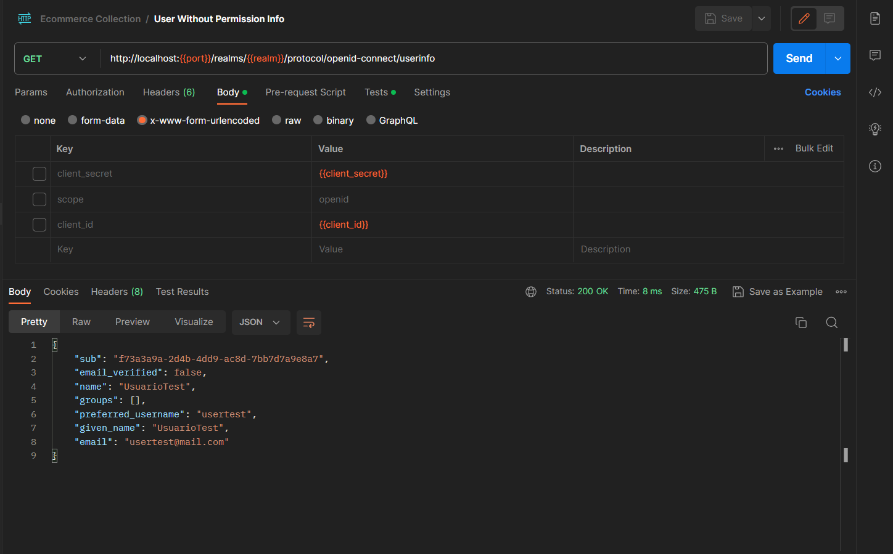

## Documentación del Proyecto

### Resumen:

El proyecto consiste en agregar módulos a un e-commerce existente para gestionar las facturas de los clientes. Se desarrollará un microservicio en Java utilizando Spring Boot para administrar las facturas. El microservicio utilizará las siguientes librerías: Eureka, OAuth2, Keycloak y Gateway. Keycloak se utilizará como servidor de autenticación y autorización para administrar la seguridad del sitio a través de clientes, roles y usuarios. Además, se aplicará Gateway para limitar el acceso a los diferentes endpoints del microservicio. Para garantizar una mayor seguridad, se implementará un JWTConverter personalizado.

### Pasos para ejecutar el proyecto:

1. Descargar el archivo zip:
   - Descargar y extraer el proyecto del archivo .zip.

2. Ejecutar Keycloak:
   - Por defecto correrá en el puerto **8080**.
   - Se creará el reino "ecommerce-realm" junto con los clientes "api-gateway-client", "ms-bills-client" y "ms-users-client".

   - Se creará el grupo PROVIDERS.

   - Se crearán los usuarios "user1" y "usertest", con permisos y sin permisos respectivamente

3. Abrir el proyecto en IntelliJ:

Abrir IntelliJ y seleccionar la opción "Open" en el menú principal.
Navega hasta el directorio raíz del proyecto y selecciona el archivo de configuración (p. ej., pom.xml para proyectos Maven) para importar el proyecto.

4. Ejecutar el servicio de descubrimiento (ms-discovery):

En IntelliJ, abre la vista "Project" en el panel izquierdo y navega hasta la carpeta del proyecto "ms-discovery".
Haz clic derecho en el archivo de configuración principal (p. ej., Application.java) y selecciona la opción "Run" o "Debug" para ejecutar el servicio de descubrimiento.
   - Por defecto correrá en el puerto **8761**.

5. Ejecutar el servicio de gateway (ms-gateway):

En IntelliJ, regresa a la vista "Project" y navega hasta la carpeta del proyecto "ms-gateway".
Haz clic derecho en el archivo de configuración principal y selecciona la opción "Run" o "Debug" para ejecutar el servicio de gateway.
   - Por defecto correrá en el puerto **9090**.

6. Ejecutar el servicio de facturas (ms-bills):

En IntelliJ, regresa a la vista "Project" y navega hasta la carpeta del proyecto "ms-bills".
Haz clic derecho en el archivo de configuración principal y selecciona la opción "Run" o "Debug" para ejecutar el servicio de facturas.
   - Por defecto correrá en el puerto **8081**.

7. Ejecutar el servicio de facturas (ms-users):

En IntelliJ, regresa a la vista "Project" y navega hasta la carpeta del proyecto "ms-users".
Haz clic derecho en el archivo de configuración principal y selecciona la opción "Run" o "Debug" para ejecutar el servicio de facturas.
   - Por defecto correrá en el puerto **8086**.

7. Ejecutar la colección de postman y sus test en el orden que figuran.

Tanto las credenciales de los usuarios como los puertos y los access token serán guardados como variables de entorno automáticamente.

